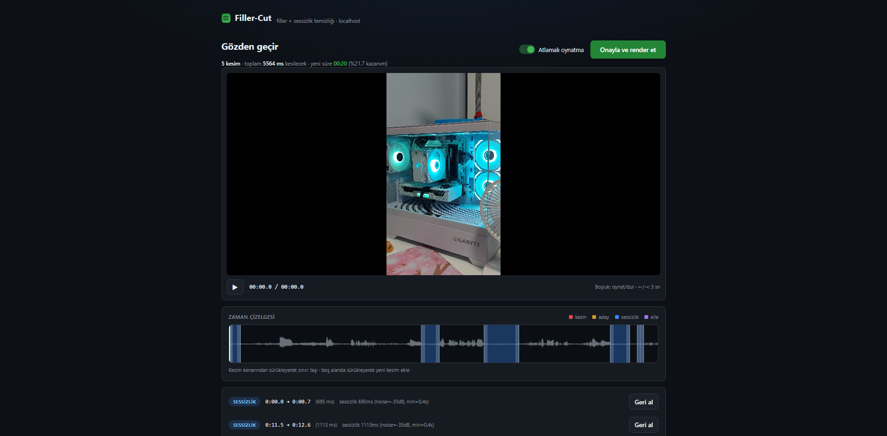
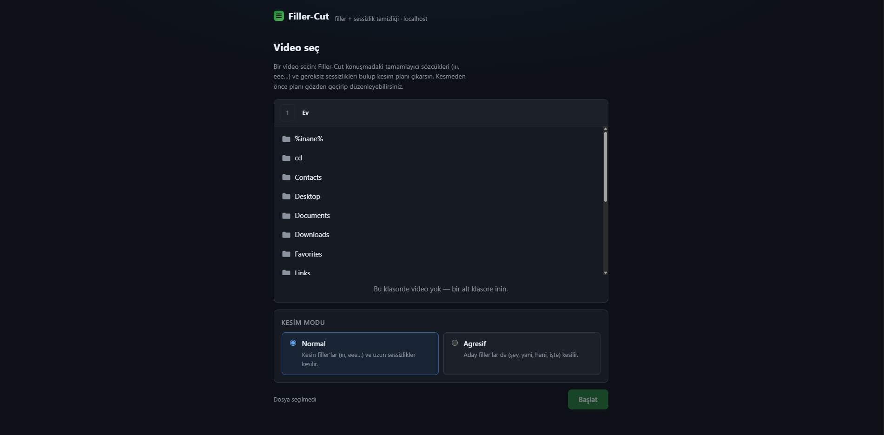
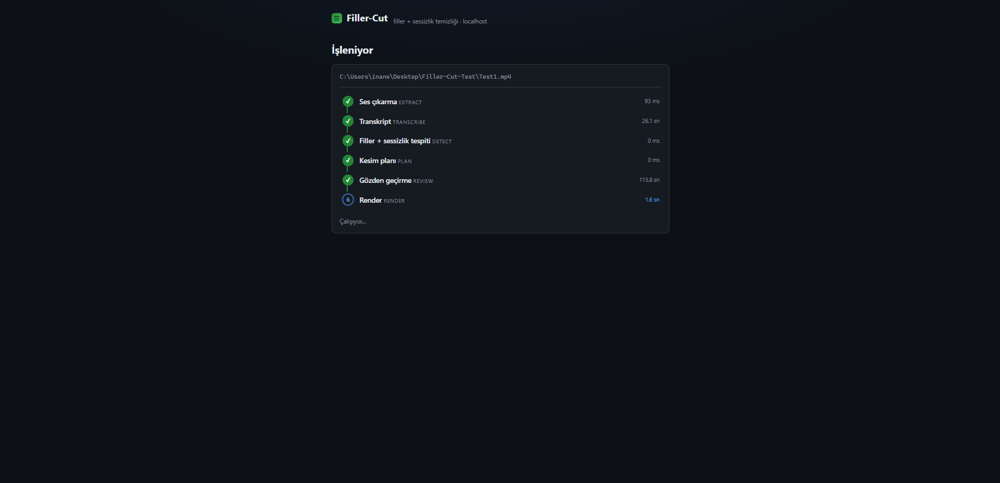
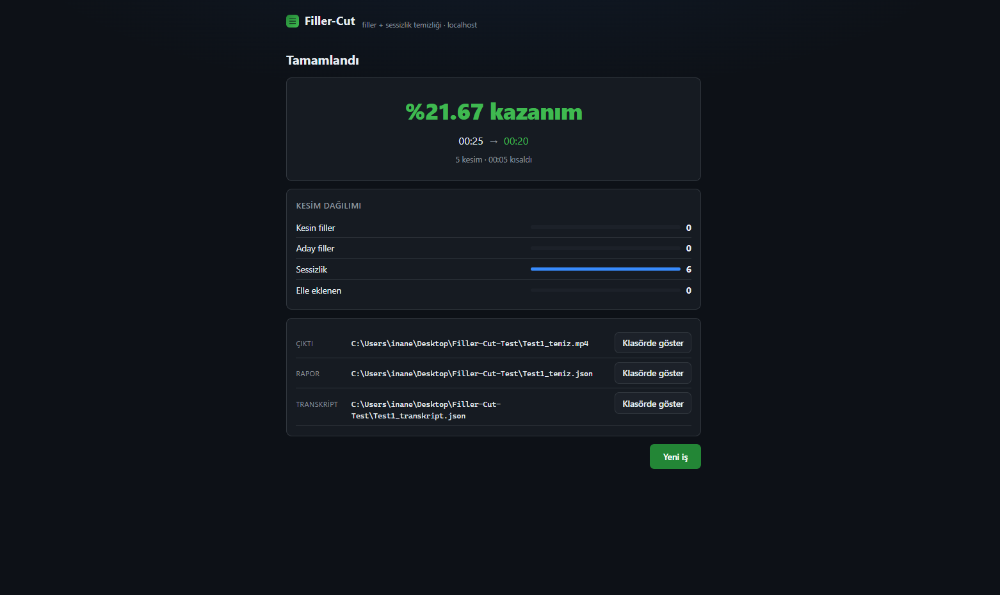

# Filler-Cut

A hardware-agnostic (AMD / Intel / NVIDIA) CLI tool that detects and cuts filler
words ("um", "uh" — Turkish: "ııı", "şey", "yani") and unnecessary silences from
video files using speech analysis.



> v0.1 — see [DESIGN.md](DESIGN.md) for the architecture.
> Türkçe: [README.tr.md](README.tr.md)

## Requirements

- Python ≥ 3.10
- **ffmpeg** and **ffprobe** on `PATH` (system dependency —
  [download](https://ffmpeg.org/download.html))

## Install

```bash
python -m venv .venv
# Windows: .venv\Scripts\activate
pip install -e .            # the CLI itself
pip install -e ".[cuda]"    # NVIDIA acceleration (cuBLAS/cuDNN for faster-whisper)
pip install -e ".[dev]"     # development: pytest, ruff, mypy
```

### Backend & hardware support

| Hardware | `faster-whisper` (default) | `whispercpp` |
|---|---|---|
| NVIDIA GPU | ✅ CUDA (official wheel) | ✅ official cublas package |
| CPU (everyone) | ✅ int8 | ✅ official bin-x64 package |
| AMD GPU | ❌ CTranslate2 has no ROCm support | ✅ Filler-Cut Vulkan build (see below) or `GGML_HIP=ON` build (ROCm 7+) |
| Intel GPU | ❌ | ✅ Filler-Cut Vulkan build (see below) |

Note: upstream whisper.cpp Windows releases ship no Vulkan/HIP binaries
(see issue #3673). Filler-Cut fills that gap with its own workflow:
`.github/workflows/vulkan-build.yml` (whisper.cpp v1.9.1, `-DGGML_VULKAN=ON`)
— on a `v*` tag push it builds and attaches the
`fillercut-whisper-cli-vulkan-win-x64.zip` to the Releases page (permanent,
no login needed); it can also be triggered manually from the Actions tab
(artifact only). The package is vendor-agnostic: one binary for
NVIDIA/AMD/Intel. On an RTX 4050 it matched CUDA speed (see KNOWN_ISSUES.md
KI-1); only the very first run pays a one-time ~10 s shader compilation. No code changes are needed on the Filler-Cut side —
the binary path comes from the `whispercpp_binary` config key.

### Vulkan package setup (releases/v0.3.0+)

For AMD/Intel users who want GPU acceleration (or NVIDIA users who don't
want a CUDA install), a ready-made package is on the
[Releases](https://github.com/inanx12/Filler-Cut/releases) page:

1. Download `fillercut-whisper-cli-vulkan-win-x64.zip`, extract it
   (e.g. `C:\tools\fillercut-whisper\`).
2. Download the model: [ggerganov/whisper.cpp](https://huggingface.co/ggerganov/whisper.cpp)
   → `ggml-large-v3-turbo-q5_0.bin` (~1.6 GB).
3. **Create `filler-cut.toml` yourself** in the folder where you run
   Filler-Cut (not shipped with the repo; paths are machine-specific,
   gitignored):

   ```toml
   config_version = 1

   [asr]
   backend = "whispercpp"
   whispercpp_binary = 'C:\tools\fillercut-whisper\whisper-cli.exe'
   whispercpp_model = 'C:\modeller\ggml-large-v3-turbo-q5_0.bin'
   ```

4. `fillercut video.mp4` — that's it.

The first run pays a one-time ~10 s shader compilation (cached to disk).
Proof the GPU is active is the `ggml_vulkan: Found 1 Vulkan devices` line
in the output. No CUDA Toolkit / Vulkan SDK needed; an up-to-date GPU
driver is enough.


## Usage

```bash
fillercut video.mp4
```

Outputs, written next to the input (or to `--output`):

- `video_temiz.mp4` — the cut video
- `video_temiz.json` — the cut report (every cut with its `reason` chain)
- `video_transkript.json` — the word-level transcript (kept even if you
  decline at the review step)

Options (identical to `fillercut --help`, which is Turkish — the CLI is
Turkish-only; these are one-to-one translations):

```
--config PATH      TOML config file (default: filler-cut.toml).
--aggressive       Also cut candidate fillers (şey, yani, hani, işte).
-y, --yes          Skip the review confirmation (render without asking).
-o, --output PATH  Output MP4 path (default: <name>_temiz.mp4).
--open             Open the review HTML in the default browser once written.
--interactive      Approve cuts one by one in the browser (local server, v0.3).
--version          Print the version and exit.
```

Before rendering, a review summary is printed and confirmation is asked
(skipped with `--yes`) — real output from a 15 s test clip:

```
[1/6] EXTRACT — 16 kHz mono WAV çıkarılıyor…
[2/6] TRANSCRIBE — transkript çıkarılıyor…
[3/6] DETECT — filler ve sessizlikler tespit ediliyor…
[4/6] PLAN — kesim planı kuruluyor…
[5/6] REVIEW
Kesim sayısı: 4
Kademe dağılımı: 1 kesin filler, 0 aday filler, 4 sessizlik
Kazanılan süre: 00:03 (00:14 → 00:11), %22.28
                 İlk 5 kesim
┌───┬───────────┬───────┬─────────┬─────────────────────────────────────┐
│ # │ Başlangıç │ Bitiş │ Tür     │ Neden (reason)                      │
├───┼───────────┼───────┼─────────┼─────────────────────────────────────┤
│ 1 │ 00:03     │ 00:04 │ filler  │ sessizlik 1018ms (…) + kesin        │
│   │           │       │         │ filler: 'Eee,' [padding +80/-120ms] │
│ 2 │ 00:06     │ 00:07 │ silence │ sessizlik 704ms (…)                 │
└───┴───────────┴───────┴─────────┴─────────────────────────────────────┘
Render edilsin mi? [y/N]:
[6/6] RENDER — segmentler encode ediliyor…
Bitti: konusma_temiz.mp4 (%22.28 kazanım)
rapor: konusma_temiz.json
transkript: konusma_transkript.json
```

> The first run downloads the Whisper model (~1 GB); later runs use the cache.

Example `video_temiz.json` (truncated):

```json
{
  "original": { "ms": 14814, "human": "00:14" },
  "cut_total": { "ms": 3300, "human": "00:03" },
  "remaining": { "ms": 11514, "human": "00:11" },
  "saved_percent": 22.28,
  "cut_count": 4,
  "tiers": { "kesin_filler": 1, "aday_filler": 0, "silence": 4 },
  "cuts": [
    {
      "start_ms": 3164,
      "end_ms": 4182,
      "duration_ms": 1018,
      "kind": "filler",
      "reason": "sessizlik 1018ms (noise=-35dB, min=0.4s) + kesin filler: 'Eee,' [padding +80/-120ms]"
    }
  ]
}
```

## Web UI

```bash
fillercut ui
```

Starts a local web interface at `http://127.0.0.1:8765` (loopback only —
never binds beyond localhost) and opens your browser. Pick a video with the
server-side file browser (files are **not** uploaded; the tool reads them
from disk, and browsing is confined to your home directory), choose
Normal/Aggressive mode, and watch the 6-stage pipeline progress live.





After PLAN the run **pauses for review**: you get the video with a waveform
timeline, every cut drawn on it, and a cut list. There you can

- play with **skip mode** on (cuts are skipped) or off (hear the original),
- **undo any cut with one click** — it stays in the list, greyed out, and one
  more click brings it back,
- **drag a cut boundary**; it snaps to the nearest silence edge,
- **drag on empty timeline** to add a cut of your own.

The header keeps a live line — how many cuts, how much will be removed, what
the new duration will be — so you see the gain before you commit to it.

Approving renders. The result screen shows the output path, the time saved, a
breakdown by cut type (definite/candidate filler, silence, your own cuts), and
which filler words were cut (`eee ×3`, `ııı ×1`…) — plus a "show in folder"
button for each output. Your edits are recorded in the report too
(`tiers.manuel`, `duzenleme`).



Options: `--port` (default 8765), `--config PATH` (the same
`filler-cut.toml` the CLI uses), `--no-browser`.

Approving without any edits produces **byte-for-byte the same file** as the
CLI run — the review screen adds control, not a different renderer.

> Jobs live in memory only — restarting the server drops them (the tool tells
> you so instead of hanging). Rendered files stay on disk.

## License

MIT — see [LICENSE](LICENSE).
